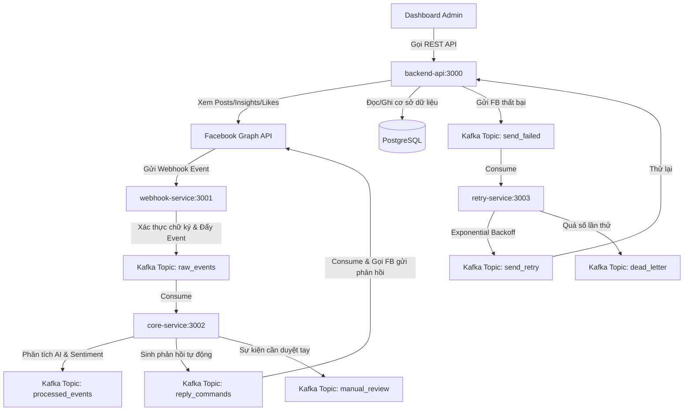

# Facebook Page API & Webhook Processing System (Microservices)

Hệ thống quản lý bài viết, phân tích chỉ số và tự động phản hồi sự kiện từ Facebook Page sử dụng kiến trúc **Microservices (Node.js/Express)**, giao tiếp qua **Kafka** và lưu trữ dữ liệu trên **PostgreSQL**.

---

## ⚙️ Sơ đồ kiến trúc & luồng dữ liệu



---

## 📁 Cấu trúc thư mục dự án

```text
.
├── fb_api/                  # Cấu hình hạ tầng Docker (Kafka, Zookeeper, Postgres, Prometheus...)
├── services/
│   ├── backend-api/         # REST API Admin Dashboard, tích hợp Facebook Graph & Database
│   ├── webhook-service/     # Nhận và xác thực Webhook từ Facebook, đẩy vào Kafka
│   ├── core-service/        # Phân tích cảm xúc (Sentiment) bằng Groq AI & sinh phản hồi tự động
│   └── retry-service/       # Xử lý hàng đợi lỗi và cơ chế tự động thử lại (Retry)
├── package.json             # Scripts quản lý khởi chạy toàn bộ hệ thống
└── README.md
```

---

## 🛠️ Quy ước cổng (Port) và Môi trường

Mỗi microservice tự quản lý cấu hình và file `.env` độc lập. Bạn cần copy file `.env.example` thành `.env` tại thư mục của từng service trước khi chạy:

| Service | Port mặc định | Thư mục cấu hình | File môi trường |
| :--- | :---: | :--- | :--- |
| **backend-api** | `3000` | `services/backend-api/` | `.env.example` -> `.env` |
| **webhook-service** | `3001` | `services/webhook-service/` | `.env.example` -> `.env` |
| **core-service** | `3002` | `services/core-service/` | `.env.example` -> `.env` |
| **retry-service** | `3003` | `services/retry-service/` | `.env.example` -> `.env` |

---

## 🚀 Hướng dẫn khởi chạy dự án

### Cách 1: Khởi chạy bằng Docker Compose (Khuyên dùng)
Bạn có thể chạy toàn bộ hệ thống (bao gồm cả Kafka, Postgres, Prometheus và các Microservices) chỉ với 1 câu lệnh duy nhất từ thư mục gốc:

```powershell
# Khởi động toàn bộ hạ tầng và các services
npm run docker:up

# Xem log thời gian thực của các container
npm run docker:logs

# Dừng hệ thống và giải phóng tài nguyên
npm run docker:down
```

### Cách 2: Khởi chạy Local từng phần bằng Node.js

#### 1. Khởi chạy hạ tầng trước (Database & Message Broker)
Dùng Docker để chạy nhanh Kafka và Postgres local:
```powershell
# Chạy Kafka container độc lập
docker run -d --name kafka -p 9092:9092 apache/kafka:latest
```

#### 2. Cài đặt dependency & khởi chạy các dịch vụ
Tại thư mục gốc, chạy lệnh để cài đặt các package cho tất cả service:
```powershell
# Cài đặt tại root và các services tương ứng
npm install
```

Sau đó, mở các tab terminal riêng biệt và chạy các lệnh start tương ứng:
```powershell
# Chạy Webhook Service (Port 3001)
npm run start:webhook

# Chạy Backend API (Port 3000)
npm run start:backend

# Chạy Core Service (Port 3002)
npm run start:core

# Chạy Retry Service (Port 3003)
npm run start:retry
```

---

## 📖 Swagger API Documentation

Sau khi `backend-api` khởi chạy, tài liệu đặc tả API và giao diện thử nghiệm Swagger UI có sẵn tại:
👉 **Swagger UI:** `http://localhost:3000/api-docs`

Các API chính được cung cấp:
- **`GET /api/page/{pageId}`**: Lấy thông tin chi tiết Page.
- **`GET /api/page/{pageId}/posts`**: Lấy danh sách bài viết.
- **`POST /api/page/{pageId}/posts`**: Đăng bài viết mới lên Page.
- **`DELETE /api/page/post/{postId}`**: Xóa bài viết.
- **`GET /api/page/post/{postId}/comments`**: Lấy danh sách comments của bài viết.
- **`GET /api/page/post/{postId}/likes`**: Lấy danh sách lượt thích của bài viết.
- **`GET /api/page/{pageId}/insights`**: Lấy báo cáo chỉ số tương tác (engaged users, impressions, fans...).

---

## 🔗 Đăng ký Webhook trên Facebook Developers

1. Tạo App trên trang [Meta for Developers](https://developers.facebook.com/).
2. Thêm sản phẩm **Webhooks** vào App của bạn.
3. Sử dụng **ngrok** để expose port 3001 của `webhook-service` ra môi trường internet:
   ```bash
   ngrok http 3001
   ```
4. Copy link URL HTTPS từ ngrok và dán vào **Callback URL** của Facebook Webhook theo định dạng:
   `https://<ngrok-subdomain>.ngrok-free.app/webhook`
5. Nhập **Verify Token** trùng khớp với cấu hình `FACEBOOK_WEBHOOK_VERIFY_TOKEN` trong `.env` của `webhook-service`.
6. Đăng ký nhận sự kiện (Subscribe) cho đối tượng **Page** với các trường cần giám sát (ví dụ: `feed`, `messages`).
